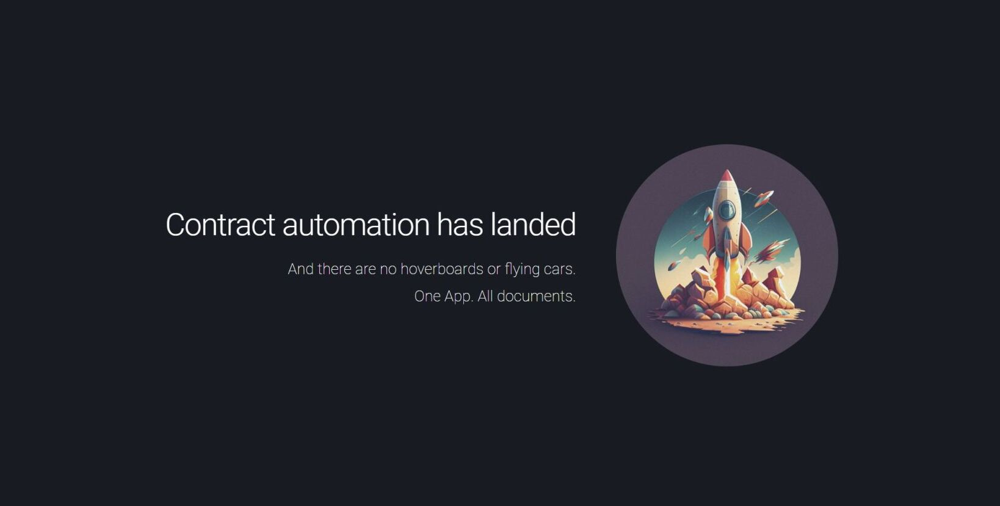

# Contract/Word Automation Web Application

The project is built using Django and allows users to upload Excel and contract files, perform automation using the uploaded files, and download the generated file. The views.py file contains the code that handles file uploads and automation.

Problem Statement:
The problem statement that this app is trying to solve is that standard documents can range to hundreds of pages that need to be maintained as details continuously change. This would mean that too many manhours are spent on drafting, checking and fixing human errors. Documents that change frequently also make things painful for people to re-do their entire document.




## Installation

Fork or download the repository.

You will need:

* Install the required packages using 

```bash
pip install -r requirements.txt.
```
* Start the server using:

```bash
  python manage.py runserver
```

How to run Django in Visual Studio Code: https://code.visualstudio.com/docs/python/tutorial-django
    
## Usage

All you need to do is upload the Excel file and your Word document. The backend will parse your document and replace any words it detects in column D with those of column C.


The **'views.py'** file contains the **'upload_files()'** function that handles file uploads and automation. 

When the user uploads the files, the **'handle_uploaded_file()'** function saves them to the desired directory. 

The **'Automation()'** function is then called with the uploaded files.

The **'Automation()'** function takes the parameters below:


- path: path to the contract file
- Workbook_name: path to the Excel file
- Work_sheetname: name of the worksheet in the Excel file
- Text_Replacement_Column: column containing the text to be replaced
- Text_Target_Column: column containing the new text

The **Automation()** function uses the win32com library to open the contract file and replace the old text with the new text. The generated contract file is saved in the demoapp/SavedFiles directory with the name 'New.docx'.


